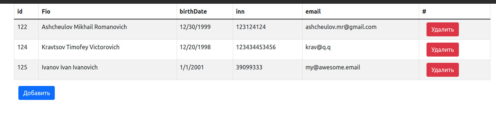
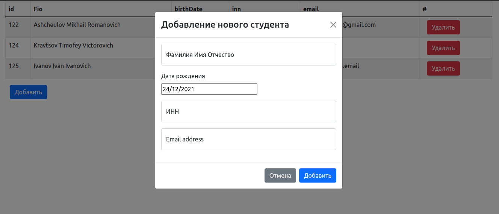
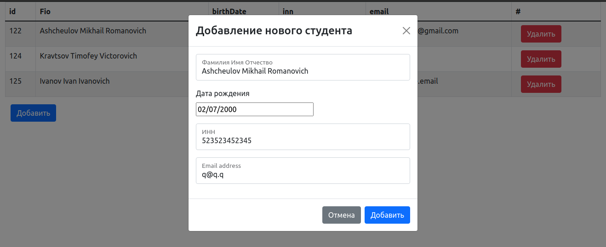
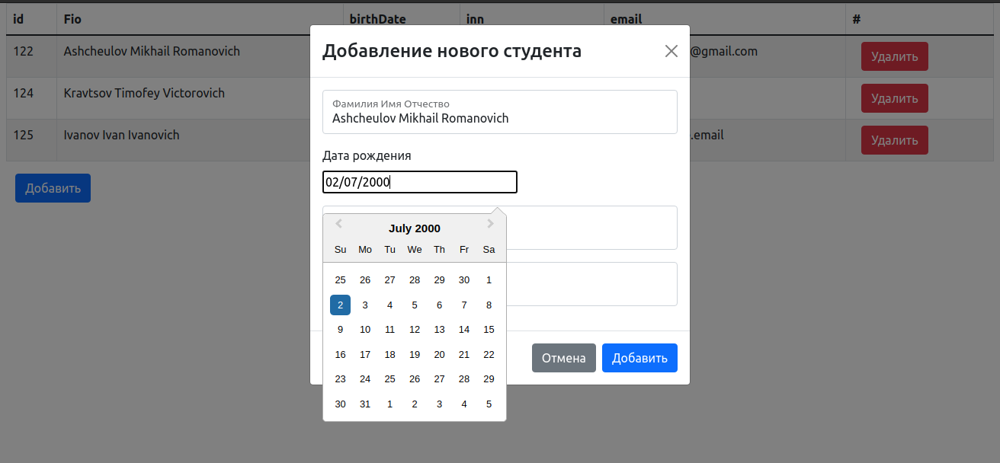

# Лабораторная работа 7

## Задание

Сделать форму ввода данных, с которой будет отправляться http rest 
запрос на сервер(вызов одного из реализованных ранее методов на вставку).

## Разработка

### Структура проекта
```
├── node_modules
│   └── ...
├── package.json
├── package-lock.json
├── public
│   ├── favicon.ico
│   ├── index.html
│   ├── logo192.png
│   ├── logo512.png
│   ├── manifest.json
│   └── robots.txt
├── README.md
├── src
│   ├── App.tsx
│   ├── components
│   │   ├── AddButton.tsx
│   │   └── DeleteButton.tsx
│   ├── index.tsx
│   └── reportWebVitals.ts
└── tsconfig.json

```

## Результат разработки

В результате разработки был разработан интерфейс для просмотра всех студентов, добавление нового и удаление.

Программа использует api /student-resource разработанное в ходе 6 лабораторной работы.

Основной интерфейс


Добавление нового студента


Добавление нового студента


Датапикер импортированный из react-datepicker 


## Запуск

Запуск происходит с помощью стандартной команды 
``
npm start
``
на порте 3000. 

В файле [`.env`](/.env) прописывается REACT_APP_API (host api).

## Работа выполнена

[Ащеулов Михаил ПИМ-21](https://github.com/VergiliusAW)

[Кравцов Тимофей ПИМ-21](https://vk.com/timofeykrav)